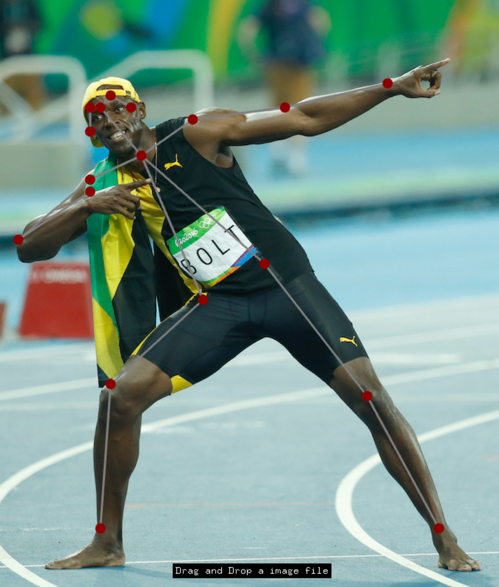

# ofxOpenCvDnnOpenPose

## Description
ofxOpenCvDnnOpenPose is an addon for openframeworks.

OpenCV v.3.3.1 or upper includes some dnn modules in their own package. Therefore I designed ofxOpenCvDnnOpenPose with OpenCV v.3.3.1 or upper version.



## Usage
See Examples for more details
```
void setup()
{
    ofImage img;
    img.load(ofToDataPath("sample.jpg"));
    openpose.update(img.getPixels());
}
void draw()
{
    ofBackground(0);
    openpose.draw();
}

```


## Install
### 1. Clone ofxOpenCvDnnColorization to your of/addon directory
    $ git clone https://github.com/TetsuakiBaba/ofxOpenCvDnnOpenPose.git
### 2. Download OpenCV.framework to ofxOpenCvDnnColorization/libs directory. 
    $ curl -O http://tetsuakibaba.jp/tmp/opencv2.framework.zip
    $ unzip opencv2.framework.zip
   
Or you may build your own opencv.framework from opencv source. ( http://tetsuakibaba.jp/ws/doku.php?id=opencv_dnn:opencv2.framework )

## Getting Started with Examples/single_image.
### 1. Download models
    $ sh getModels.sh
### 2. Update single_image with the projectGenerator.

### 3. Run

## Compatibility
- only macOS ( tested on Mojave)
- of version: 0.10.1

## Licence
[MIT](https://opensource.org/licenses/MIT)

## Author
[TetsuakiBaba](https://github.com/TetsuakiBaba)

## Reference
1. https://ws.tetsuakibaba.jp/doku.php?id=opencv_dnn:openpose

